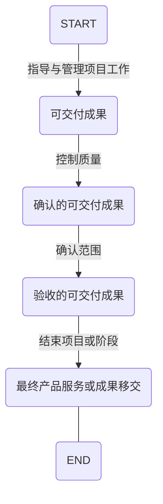

>画mardkwon的流程图简直是疯了;
>`flow` 和 `mermaid`

项目可交付成果从：**指导与管理项目工作-控制质量-确认范围-结束项目或阶段** 的过程的说明。



<!-- more -->

---

> flow图，condition感觉不太适合；

```flow
st=>start: START
op1=>operation: 可交付成果
op2=>operation: 确认的可交付成果
op3=>operation: 验收的可交付成果
op3=>operation: 最终产品、服务或成果移交
e=>end: END

sub1=>subroutine: 可交付成果指的是在某一过程、阶段或项目完成时，必须产出的任何独特并可核实的产品、成果或服务能力。
sub2=>subroutine: 已经完成并经过实施质量控制过程检验合格的可交付成果。
sub3=>subroutine: 符合验收标准的可交付成果应该由客户或发起人正式签字皮质呢。
sub4=>subroutine: 移交项目所产出的最终产品、服务或成果。

io1=>inputoutput: 指导与管理项目工作
io2=>inputoutput: 控制质量
io3=>inputoutput: 确认范围
io4=>inputoutput: 结束项目或阶段

st->io1
io1(right)->op1
op1->sub1
io1->io2
io2(right)->op2
io2(bottom)->io3
io3(right)->op3
io3(bottom)->io4
io4(bottom)->e
```
